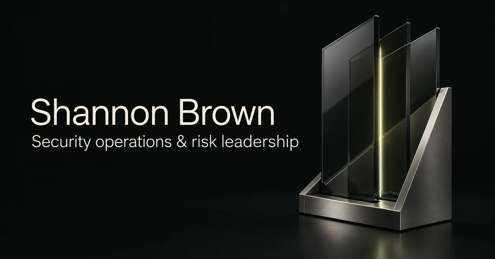

  <a href="https://swb2019.github.io/shannon-brown-career/"><strong>Professional portfolio ↗</strong></a> &nbsp; · &nbsp;
  <a href="https://swb2019.github.io/gsoc-decision-ops/">Try Hourglass Command</a> &nbsp; · &nbsp;
  <a href="https://www.linkedin.com/in/shannon-w-brown">LinkedIn</a>

## Clear judgment. Accountable operations. Useful systems.

I’m Shannon Brown, a security operations and risk-management leader in Massachusetts. I direct a **24-member, 24/7 global security operations center** for a Fortune 500 pharmaceutical client through Allied Universal. My work connects operational governance, incident coordination, commercial judgment, and executive communication.

I build tools that make complex decisions easier to understand, practice, and explain.

| Operational leadership                                                                                    | Commercial judgment                                                                                                   | Technical foundation                                                                                          |
| :-------------------------------------------------------------------------------------------------------- | :-------------------------------------------------------------------------------------------------------------------- | :------------------------------------------------------------------------------------------------------------ |
| Promoted from GSOC Analyst to Manager in ten months. Lead supervisors, analysts, and technical personnel. | Delivered **$7 million in annual savings** through primary-supplier negotiation at Phoenix Far East Investment Group. | Harvard **ALM, Information Management Systems** and **ALB, Business Administration & Management, cum laude**. |

## Selected work

### [Hourglass Command ↗](https://swb2019.github.io/gsoc-decision-ops/)

**First-hour judgment under incomplete information.** A working GSOC decision-training simulation with a six-chapter campaign, converging physical and cyber signals, explicit operating postures, and exportable after-action reviews.

[Explore the source](https://github.com/swb2019/gsoc-decision-ops) · [Read the training methodology](https://github.com/swb2019/gsoc-decision-ops/blob/main/docs/TRAINING.md)

### [Professional portfolio ↗](https://swb2019.github.io/shannon-brown-career/)

The story behind the work: security leadership, cross-border investment experience, education, and credentials. An editorial web experience with original 3D artwork and interactive motion.

[Explore the source](https://github.com/swb2019/shannon-brown-career) · [View résumé](https://swb2019.github.io/shannon-brown-career/resume.pdf)

## Focus

Operational governance · Risk assessment · Contract and supplier review · Incident coordination · Executive briefings · Continuous improvement

**Credentials:** Harvard Cybersecurity Graduate Certificate · CompTIA CySA+ ce · CompTIA Security+ ce

---

**Let’s connect.** [LinkedIn](https://www.linkedin.com/in/shannon-w-brown) · [Email](mailto:shannon@i-mail.se) · Whitinsville, Massachusetts
